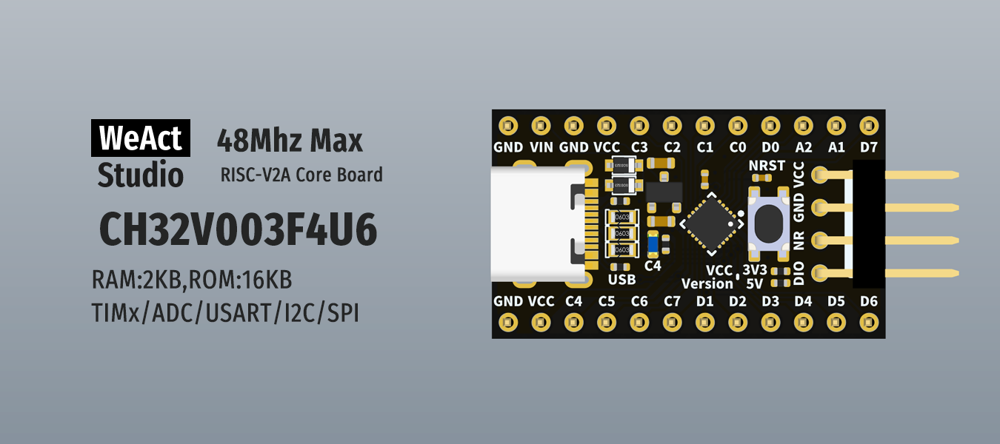

* [English version](./README.md)
# WeActStudio.CH32V003CoreBoard

CH32V003F4U6
> 48Mhz Max,2KB RAM,16KB ROM

WCH 官方网站 www.wch.cn

|目录名称|内容|
| :--:|:--:|
|Doc| 数据手册/参考手册|
|Hardware| 硬件开发资料|
|Examples|软件例程|
|SDK|软件SDK|
|Tools|工具|

```
/*---------------------------------------
- WeAct Studio Official Link
- taobao: weactstudio.taobao.com
- aliexpress: weactstudio.aliexpress.com
- github: github.com/WeActStudio
- gitee: gitee.com/WeAct-TC
- blog: www.weact-tc.cn
---------------------------------------*/
```